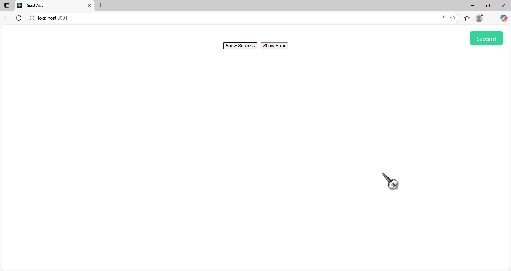
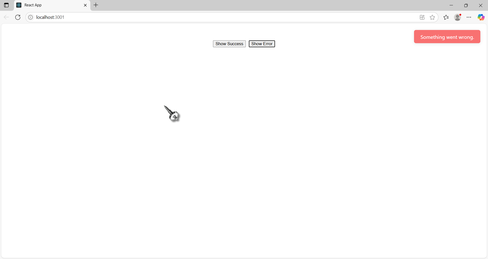

# 🔔 React Notification System

A simple, elegant notification system built with **React Context API** and **useReducer**. This project demonstrates how to manage global notifications (success & error) without any external library.

---

## ✨ Features

- ✅ Global notification management using Context API
- ✅ Smooth auto-dismiss after 3 seconds
- ✅ Success & error types with distinct styles
- ✅ Minimal and clean codebase
- ✅ Fully customizable

---

## 📦 Tech Stack

- React
- Context API
- useReducer
- JavaScript (ES6+)
- CSS-in-JS styling

---

## 🚀 Getting Started

### 1. Clone the Repo

```bash
git clone https://github.com/yourusername/react-notifications.git
cd react-notifications

2. Install Dependencies

npm install

3. Run Locally

npm start

The app will open at http://localhost:3000
🧠 Project Structure

src/
│
├── App.js                  # Root component with Provider
├── NotificationContext.js  # Global notification state manager
├── Notification.js         # UI for showing notifications
└── TriggerButton.js        # Buttons to show notifications

## 🖼️ Screenshots

| Success Notification | Error Notification |
|----------------------|--------------------|

|  |  |


🛠️ Customize

Want to customize colors, duration, or animations?
Modify the styles inside Notification.js:

backgroundColor: state.type === 'error' ? '#f87171' : '#34d399'

📄 License

This project is open-source and available under the MIT License.
💡 Inspiration

Built to demonstrate how powerful and clean React Context + Reducer can be for small-to-medium global state needs like notifications.
